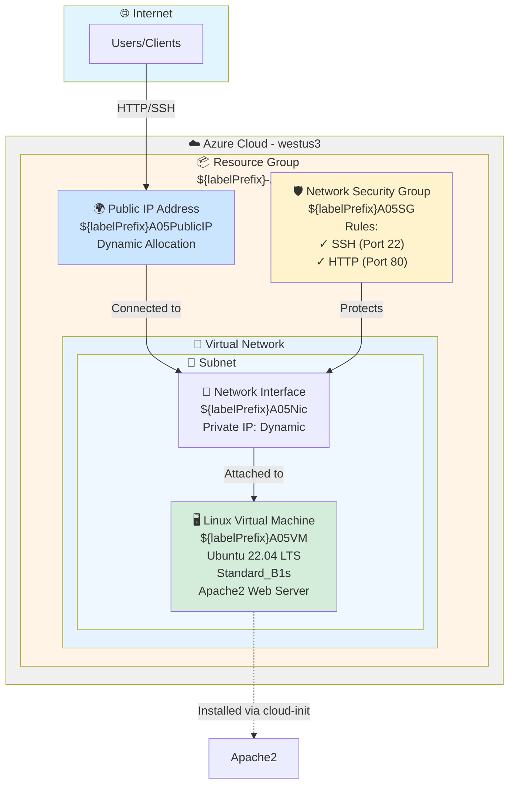

# Azure Web Server Architecture Diagram

## Architecture Components

### Network Layer
- **Virtual Network (VNet)**: 10.0.0.0/16 CIDR block
- **Subnet**: 10.0.1.0/24 CIDR block within the VNet
- **Public IP**: Dynamic allocation for external access

### Compute Layer
- **Virtual Machine**: Standard_B1s size running Ubuntu 22.04 LTS
- **Web Server**: Apache2 installed automatically via cloud-init script

### Security Layer
- **Network Security Group**: Controls inbound traffic
  - SSH access on port 22
  - HTTP access on port 80
- **Network Interface**: Connects VM to the network with security group attached

### Resource Organization
- **Resource Group**: Logical container for all resources in westus3 region

## Traffic Flow

1. **Inbound Traffic**: Internet → Public IP → Network Interface → Virtual Machine
2. **Security**: Network Security Group filters traffic at the NIC level
3. **Web Service**: Apache2 serves HTTP requests on port 80
4. **Management**: SSH access available on port 22 for administration
